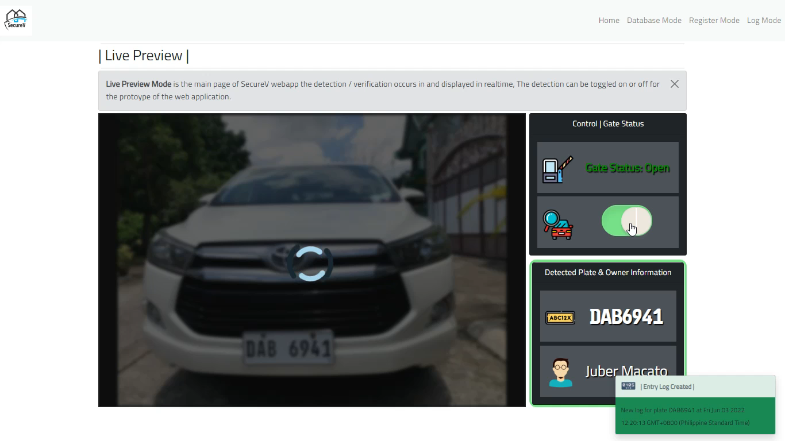
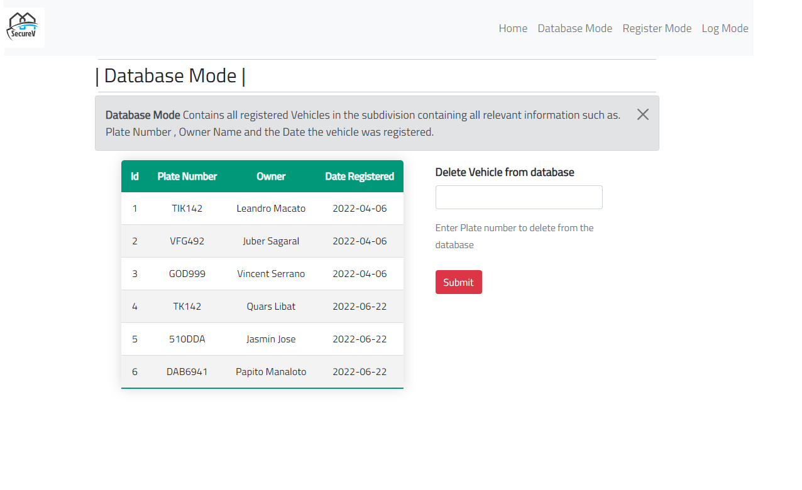
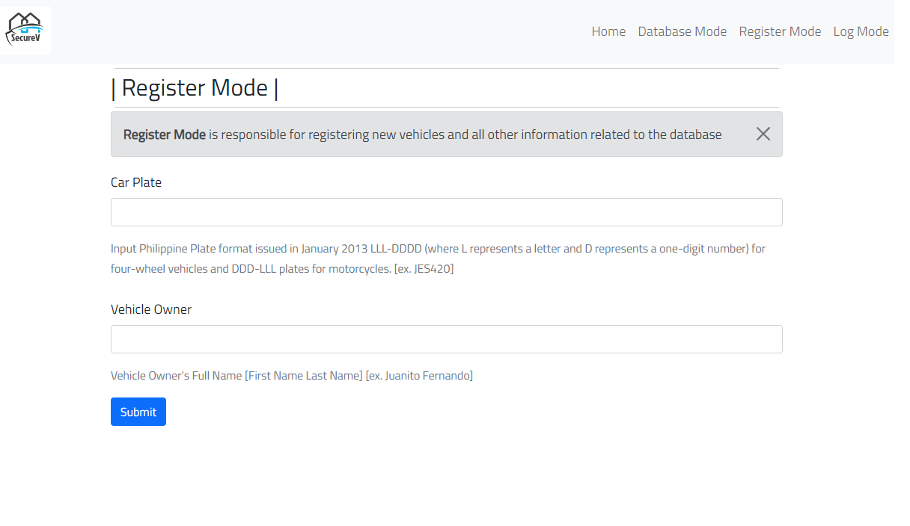

# SecureV


- [SecureV](#securev)
  - [About](#about)
    - [Technologies Used](#technologies-used)
      - [Frontend](#frontend)
      - [Backend/Database](#backenddatabase)
      - [Machine Learning Tech](#machine-learning-tech)
  - [Installation](#installation)
    - [1. Clone Repository](#1-clone-repository)
    - [2. pip install requirements](#2-pip-install-requirements)
    - [3. Download YOLOv4 Model and Place inside directory](#3-download-yolov4-model-and-place-inside-directory)
    - [4. Install Tesseract on local machine](#4-install-tesseract-on-local-machine)
      - [4.1 Set tesseract.exe path in object_detection.py file](#41-set-tesseractexe-path-in-object_detectionpy-file)
      - [4.2 Download Tesseract Trained Model on FE-Schrift Font and place in tesseract installation folder](#42-download-tesseract-trained-model-on-fe-schrift-font-and-place-in-tesseract-installation-folder)
    - [5. Run Flask Server](#5-run-flask-server)
  - [Screenshots](#screenshots)
  - [License & Copyright](#license--copyright)

---

## About

A Automatic Plate Recognition Verification Web application using custom trained YOLOv4 CNN model

---

### Technologies Used

#### Frontend

- 
- 
- 

#### Backend/Database

- 
- 
- 

#### Machine Learning Tech

- YoloV4
- Tesseract

---

## Installation

### 1. Clone Repository

```cmd
git clone https://github.com/LeandroMartinMacato/SecureV-App
```

### 2. pip install requirements

```cmd
pip install -r requirements.txt
```

### 3. Download YOLOv4 Model and Place inside directory

[Download: YOLOv4 Weights](https://drive.google.com/file/d/15PGJ8fvPZA2qOLaNVrRryJU7X-QXEa1H/view?usp=sharing)

- Place yolov4.weights in

```cmd
./app/models/~
```

### 4. Install Tesseract on local machine

[Download: Tesseract](https://github.com/tesseract-ocr/tesseract/releases)

#### 4.1 Set tesseract.exe path in object_detection.py file

- on object_detection.py

```cmd
tess.pytesseract.tesseract_cmd = r"E:\Programming_Files\OCR-Tesseract\tesseract.exe"
```

#### 4.2 Download Tesseract Trained Model on FE-Schrift Font and place in tesseract installation folder

[Download: Custom Trained Tesseract Model](https://drive.google.com/file/d/1CYN4XOAJe12P-UShk3tn4LZSMgvIFnjs/view?usp=sharing)

- Place bestphplate.traineddata in

```cmd
tesseract_installation_folder/tessdata/
```

### 5. Run Flask Server

```
./cd app
./app python app.py
```

---

## Screenshots

|          |  |
| :------------------------------------------------: | :------------------------------------------------: |
|  |            |

## License & Copyright

Licensed under the [MIT License](LICENSE)
